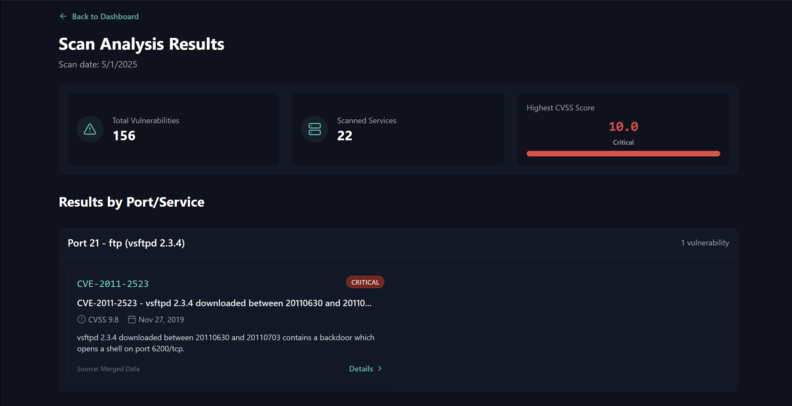

# 🛡️ CVE DATABASE 🛡️

  
  
  
  
  

## 📊 Database Overview

  

A comprehensive collection of Common Vulnerabilities and Exposures (CVEs) maintained and updated regularly. This repository serves as a central hub for security researchers, penetration testers, and cybersecurity professionals to access detailed information about known vulnerabilities.

## 🔍 Features

<table>
  <tr>
    <td width="50%">
      <h3 align="center">🔄 Regular Updates</h3>
      
Database synchronized daily with latest CVE publications

    </td>
    <td width="50%">
      <h3 align="center">🔎 Advanced Search</h3>
      
Find vulnerabilities by vendor, product, severity, or date

    </td>
  </tr>
  <tr>
    <td width="50%">
      <h3 align="center">📈 Severity Analysis</h3>
      
CVSS scores and detailed impact assessments

    </td>
    <td width="50%">
      <h3 align="center">🧩 Exploit References</h3>
      
Links to related exploits and proof-of-concepts

    </td>
  </tr>
</table>

## 🔐 Top Vulnerability Categories

  <table>
    <tr>
      <th>Category</th>
      <th>Count</th>
      <th>Avg. Severity</th>
    </tr>
    <tr>
      <td>Remote Code Execution</td>
      <td>1,243</td>
      <td>⚠️⚠️⚠️⚠️⚠️</td>
    </tr>
    <tr>
      <td>SQL Injection</td>
      <td>987</td>
      <td>⚠️⚠️⚠️⚠️</td>
    </tr>
    <tr>
      <td>Cross-Site Scripting</td>
      <td>1,568</td>
      <td>⚠️⚠️⚠️</td>
    </tr>
    <tr>
      <td>Authentication Bypass</td>
      <td>643</td>
      <td>⚠️⚠️⚠️⚠️</td>
    </tr>
    <tr>
      <td>Denial of Service</td>
      <td>892</td>
      <td>⚠️⚠️</td>
    </tr>
  </table>

## 🤝 Contributing

Contributions are welcome! Please feel free to submit a Pull Request.

1. Fork the repository
2. Create your feature branch (`git checkout -b feature/amazing-feature`)
3. Commit your changes (`git commit -m 'Add some amazing feature'`)
4. Push to the branch (`git push origin feature/amazing-feature`)
5. Open a Pull Request

## 📜 License

This project is licensed under the MIT License - see the [LICENSE](LICENSE.md) file for details.

## 📞 Contact

Navin Hariharan - [@navin_hariharan](https://twitter.com/navin_hariharan)

Project Link: [https://github.com/navin-hariharan/CVE-DATABASE](https://github.com/navin-hariharan/CVE-DATABASE)

  

